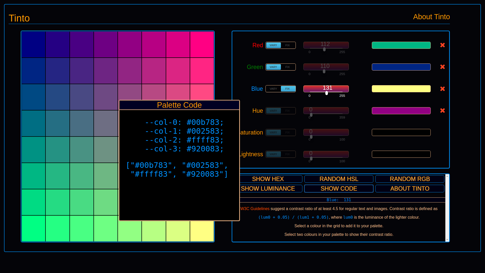

# Tinto - a tool for creating colour palettes

- Deployed to  

## Functionality and Use

Tinto is a tool for web developers and designers, or indeed anyone who has to work with digital colours.

It lets you

- Find precisely the colours you like
- Show their hex values
- Check their luminance
- Add them to your palette
- Check the contrast ratio of any two colours in your palette
- Copy the code for your palette as CSS custom properties or an array of hex strings
- Delete unneeded colours from your palette
- Work with an RGB or an HSL colour model
- Generate random RGB or random HSL colours
- Vary or fix any of the colour components

It should be fairly intuitive to use Tinto. Play with the buttons and sliders to vary the colours in the grid, and if you find a colour you like, click/tap it to add it to the palette.

Click the red *X* to remove a colour from the palette.   Newly chosen colours will fill any gaps.

Clicking "*Show Hex*" or "*Show Luminance*" will display these values in the grid and in the palette.   In the grid, only one of these will be shown; luminance takes precedence over hex.

Any components that are fixed will be shown, with their fixed values, in the blue bar in the control panel.

More details about web standards for contrast ratio can be found at https://www.w3.org/TR/UNDERSTANDING-WCAG20/visual-audio-contrast-contrast.html

Tinto is deployed to https://teraspora.github.io/tinto/

## Notes

Tinto has been developed by me, John Lynch, this summer 2019, initially as a tool for myself, to help me find nice complementary colour schemes for websites.   As it grew in functionality I realised it could also be useful for other front-end developers and designers.

It should work fine on large screens and on most mobiles, though on iPhones of various sorts the display may be substandard.   I have yet to investigate this properly but am certainly open to pull requests.   Tinto lives at https://github.com/teraspora/tinto

More fun and interesting projects can be found on [My Github page](https://github.com/teraspora/)

## Development log

* 11 June 2019:
    Most functionality now implemented, except
        - Contrast ratio calculation and display DONE!
        - Let user move modal DONE!
        - Write content for 'About' page DONE!

    Responsive layout CSS needs fixing! PARTIALLY DONE!
    
    Don't re-generate on show/hide hex/lum, just do the show/hide!

    Improve UX for 'show-hex' when Luminance is showing.

    Don't display 'Remove' button for inactive palette slots. DONE!

    Refactor code to use a common method of getting DOM elements in the `#controls` grid, indexing them with `data-` attributes perhaps, and creating a general function for getting such an element, and other functions for things like toggling the state in various ways, so the code will be much cleaner and more modular.

    

